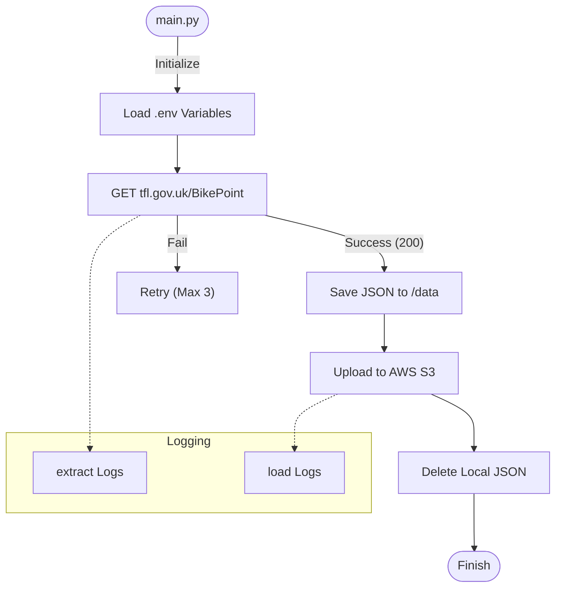

<div align="center">

# 🚲 TfL BikePoint Data Pipeline


<br />

<p>
  <b>A ELT script that extracts live cycle hire data from Transport for London (TfL) and archives it to AWS S3.</b>
</p>

</div>

---

## 📋 Table of Contents
- [Overview](#-overview)
- [Workflow Architecture](#-workflow-architecture)
- [Project Structure](#-project-structure)
- [Prerequisites](#-prerequisites)
- [Environment Configuration](#-environment-configuration)
- [Running the Pipeline](#-running-the-pipeline)

---

## 📖 Overview

This project captures real-time data from the **TfL BikePoint API**, which provides the status, location, and availability of cycle hire docking stations across London. The pipeline is designed to:

1.  **Extract:** Query the TfL API for the latest station data.
2.  **Save:** Store the raw JSON response locally with a precise timestamp.
3.  **Load:** Upload the JSON file to a specified AWS S3 bucket.
4.  **Cleanup:** Remove the local file to maintain a clean environment.

---

## ⚙️ Workflow Architecture




---

## 📂 Project Structure

The project assumes the following modular structure:

```text
├── modules/
│   ├── __init__.py       # (Optional)
│   ├── extract.py        # Logic to fetch data from TfL API
│   ├── load.py           # Logic to upload files to S3
│   └── logging.py        # Logging configuration
├── main.py               # Orchestrator script
├── .env                  # Secrets (Not committed to Git)
└── requirements.txt      # Dependencies

```

---

## 🛠 Prerequisites

Ensure you have Python installed. Install the necessary packages using pip:

```bash
pip install requests boto3 python-dotenv

```

---

## 🔐 Environment Configuration

Create a `.env` file in the root directory. This keeps your AWS credentials secure.

```ini
# .env file

# AWS Credentials
AWS_ACCESS_KEY=your_access_key_here
AWS_SECRET_KEY=your_secret_key_here

# S3 Configuration
bucket_name=your_s3_bucket_name

```

---

## 🚀 Running the Pipeline

To execute the script, simply run `main.py`. This is ideal for setting up as a Cron job or a Scheduled Task.

```bash
python main.py

```

### Outputs

* **Console:** Displays status messages (e.g., `Download successful`, `found X files`).
* **Logs:** Generates folder-based logs (`extract_logs/`, `load_logs/`) timestamped for every run.
* **S3:** The JSON data will appear in the root of your target S3 bucket.

---

<div align="center">
<sub>Built with 💖 using Python</sub>
</div>
